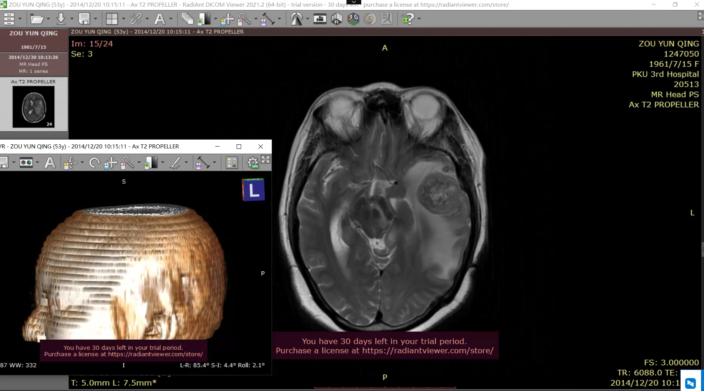
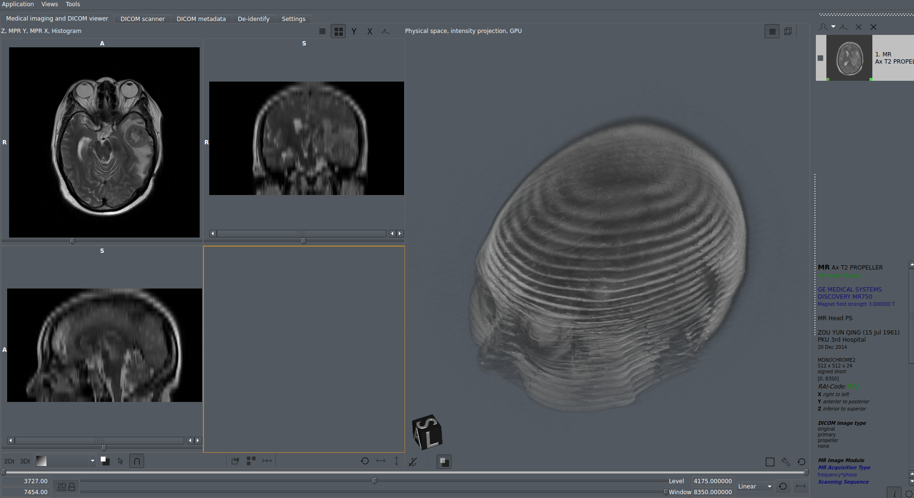

# Applications

---

## App

- 3D Slicer
    - a free, open source and multi-platform software package widely used for medical, biomedical, and related imaging research
	  - SlicerDMRI: an open-source project to improve and extend diffusion magnetic resonance imaging software in 3D Slicer

- InVesalius: Open source software for reconstruction of computed tomography and magnetic ressonance images.

- Materialise Mimics: a medical 3D image-based engineering software that efficiently takes you from image to 3D model and allows you to scale from R&D to high-volume clinical operation

- ImageJ: Java image processing program

- creatis VV: n open-source and cross platform image viewer, designed for fast and simple visualization of spatio-temporal images: 2D, 2D+t, 3D and 3D+t (or 4D) images

- OsiriX Viewer (macOS): DICOM viewer

- RadiAnt DICOM Viewer (Windows): 一个医学图像的PACS DICOM浏览器

  

		
- Aliza MS DICOM Viewer

  

		
## Convertor

- dicom2stl
    - a script that takes a Dicom series and generates a STL surface mesh
	  - python dicom2stl.py -i 128 -o tmp.stl /home/cg/Downloads/dicom-dir

- [DICOM to NRRD (online)](ttps://www.onlineconverter.com/dicom-to-nrrd)

- nrrdify: utility scripts for converting dicom to nrrd (DWI)

## Libs

- [ITK](https://itk.org/)
