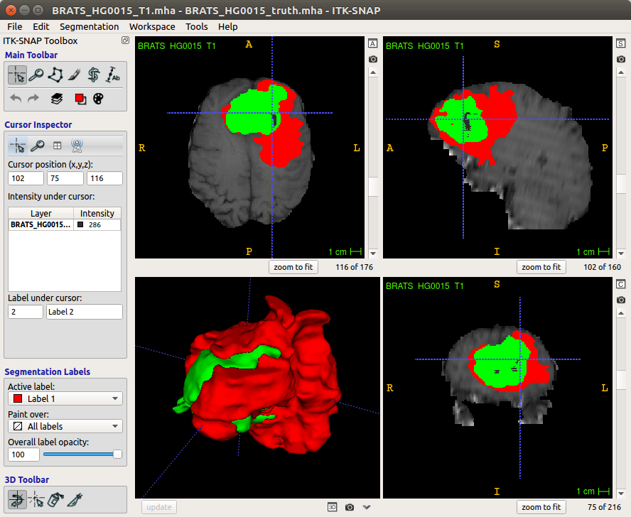

# Image Processing

---

## 图像分割

方法

- 传统阈值法
- Otsu阈值法
- 基于区域的分割
- 活动轮廓法
- 水平集方法

软件

- ITK-SNAP: used to segment structures in 3D medical images

  

## 图像配准

- elastix: 基于ITK

## 图像分析

基于深度学习的医学图像分析

## 软件库

-	ITK
